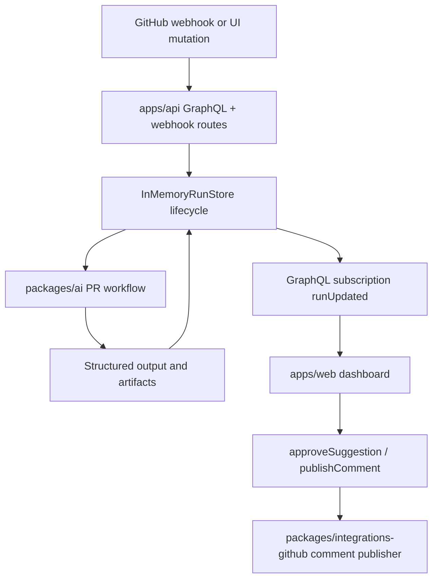

# Architecture Overview

Patchloom is a GraphQL-first engineering workflow assistant with AI orchestration and optional GitHub integration.

## High-Level Components
- `apps/web`: React dashboard for runs, approvals, and publish controls.
- `apps/api`: Apollo GraphQL server with run lifecycle, subscriptions, and governance flows.
- `packages/ai`: provider-agnostic AI workflow layer (Gemini first).
- `packages/integrations-github`: GitHub webhook verification, PR reading, and comment publishing.
- `packages/core`: shared workflow domain types.
- `packages/config`: env validation and runtime config.
- `packages/db`: database connection and migrations.

## Runtime Flow

## Core Design Decisions
- GraphQL-first API for human and agent consumers.
- Structured outputs over free-form text.
- Human approval before write actions.
- Idempotent publication for GitHub comments.
- Read-only workflows first; write flows gated by approvals.

## Run Lifecycle
- `queued`
- `running`
- `waiting_for_approval`
- `completed`
- `failed`
- `cancelled`

## Reliability
- Retry with exponential backoff for transient model-call failures.
- Timeout handling for model calls.
- Structured run-state logging with `runId`, `workflowType`, `provider`, `state`, and optional error.

## Demo Mode
- `DEMO_MODE=true` seeds representative runs on API startup.
- Allows local evaluation without GitHub credentials.
